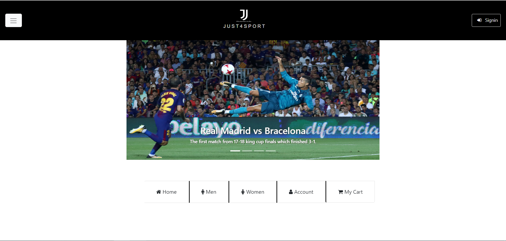
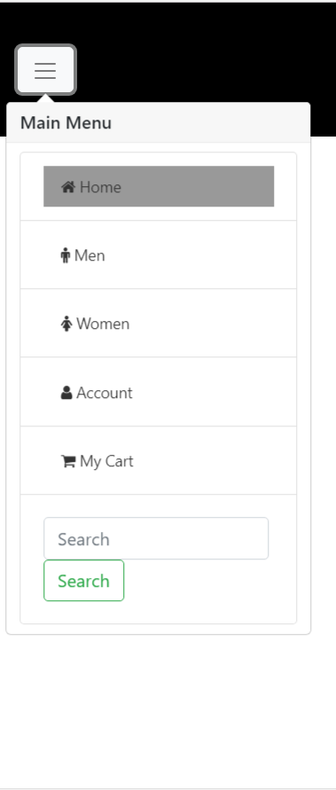
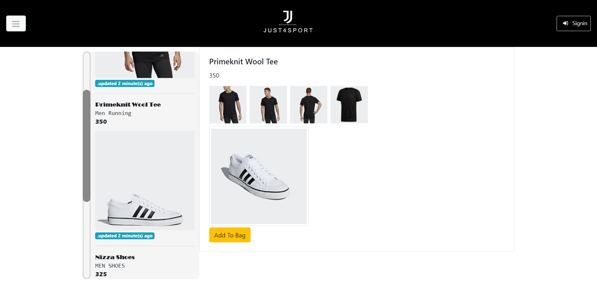
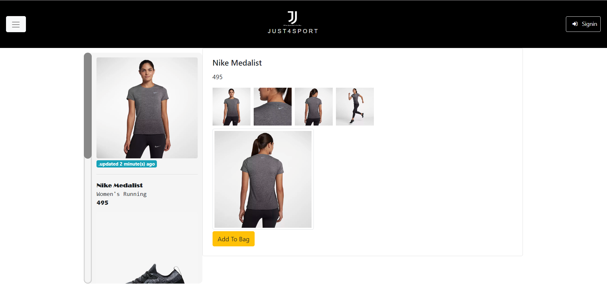
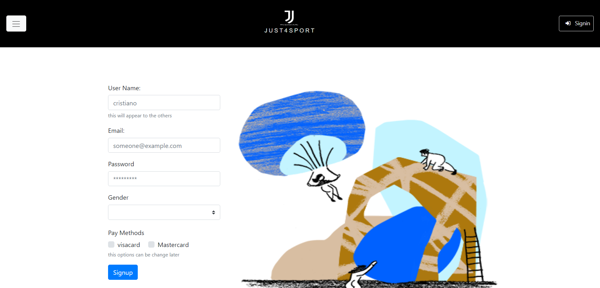
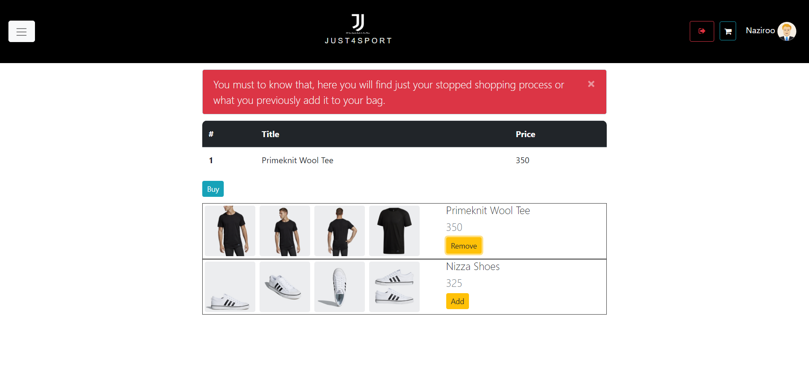
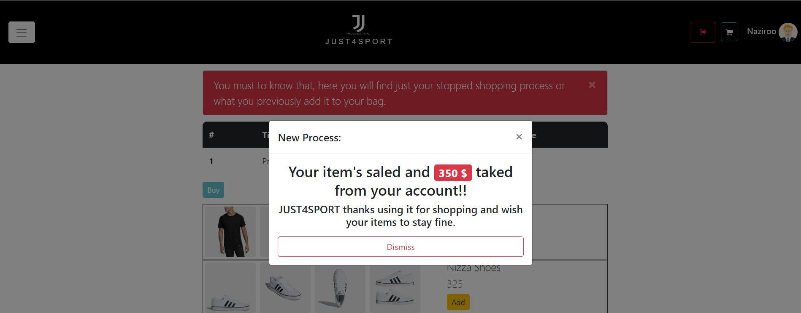

# Just4Sport
An online shopping center for sport equipment. developed using Vue.js framework
- Webpack bundler is used, <a href="https://webpack.js.org/">about</a>.
- Vue-Resorce is used to handle http request issue.
- Vue-Router is used to handle page routing issue.
- Bootstrap-Vue is used as Bootstrap source.
- Vue-Session is used to save session data.
<h3>How to use</h3>
<ul>
  <li>Clone/Download the repo.</li>
  <li>Open <strong>cmd</strong> at the folder location.</li>
  <li>
    
<code># install dependencies</code>

    
<code>npm install</code>

    
<code># serve with hot reload at localhost:8080</code>

    
<code>npm run dev</code>

    
<code># build for production with minification</code>

    
<code>npm run build</code>

  </li>
## Sreenshots 

